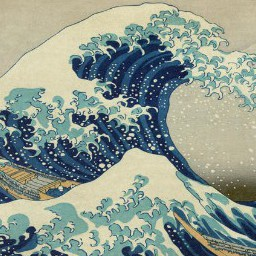
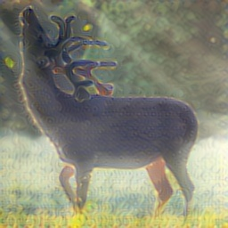

# style-transfer
An inplementation of style-transfer using tensorflow. 用tensorflow实现的图像风格转换网络。

## 参考：
[Perceptual losses for real-time style transfer and super-resolution](https://arxiv.org/abs/1603.08155)

[代码主要参考](https://github.com/lengstrom/fast-style-transfer)

加了很多中文注释，版本适合Python3。

## 环境：
 - python 3.6.1
 - tensorflow 1.3.0

## 运行：
 - 训练：
 ```sh
 python ./style.py --content_images_dir your_content_dir --style_image_path your_style_file_path --output_dir  your_output_dir --vgg_path path_to_imagenet-vgg-verydeep-19.mat --epoch_num 10000
```

## 结果

由于没有强力GPU，没得出有效的结果。不过大体的样子有了，如下图：
| 原图        | 风格图    |  结果图  |
| :----:   | :----:   | :----: |
|         |       |       |

可以看出，结果图中已经有波浪的纹理出现。

## 关于结果的讨论

在训练过程中有几点思考：

    1、content、style、tv三者的比例控制着最终生成图片的效果。
    
    2、本次测试训练没有采用大量的训练数据。原文章采用的是COCO数据集。关于训练慢的分析：
        （1）loss整体下降很快，后面就进入一段很长的平台期。估计和learning rate有关。
        （2）没有采用大量数据。网络对图片过拟合，导致后面loss实际上很小。这就类似于在一张图片上加上某些噪声，显示效果并没有改变。

    3、有趣的一点：
        网络是先大幅降低content_loss，再降低style_loss，tv_loss是先升后降（这是符合直觉的，因为最开始图像就是一坨灰色）。这是否和人观察事物的顺序一样呢，先观察整体特征，再观察风格特征，最后观察细节。
